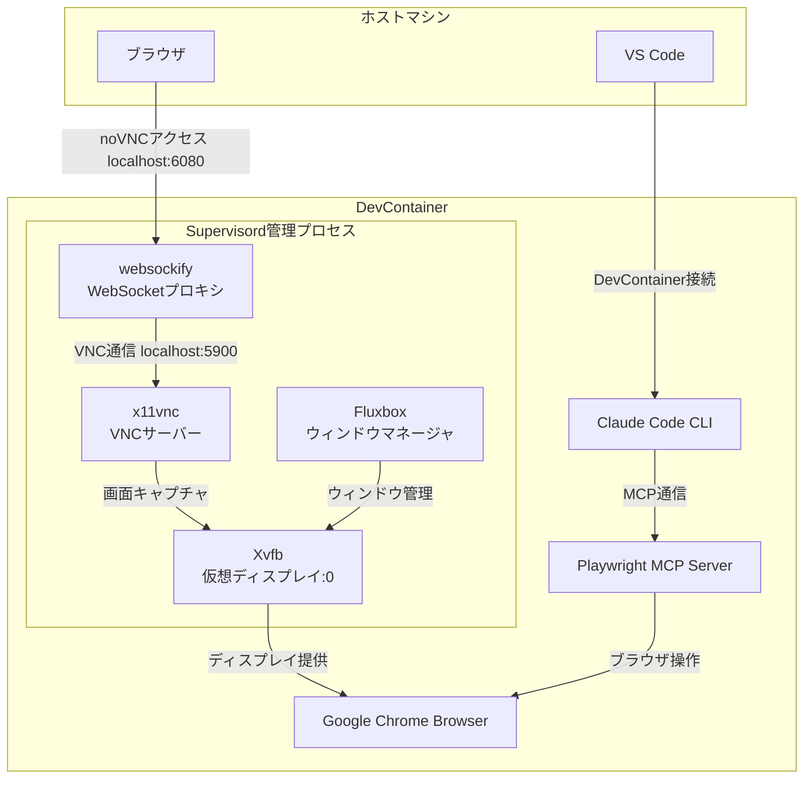
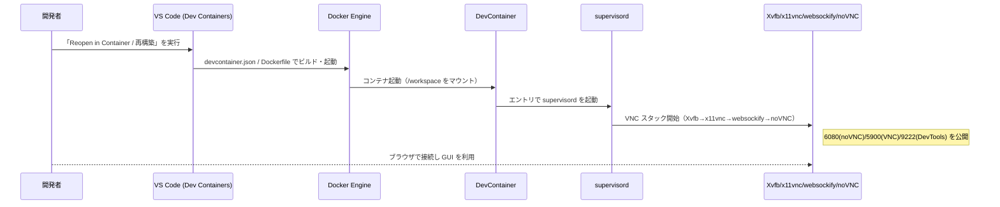

# DevContainer ガイド（Power Sequence Designer）

このドキュメントは、本プロジェクトの DevContainer 設定を俯瞰し、誰でも同じ環境で開発・検証できるようにまとめたものです。全体像、構成、起動フロー、カスタマイズ、運用、トラブルシューティングを MECE（Mutually Exclusive, Collectively Exhaustive）で整理しています。

## 1. 目的 / スコープ（What / Scope）

- 同一の再現性ある開発環境を提供
- GUI（VNC/noVNC）を用いたブラウザ連携や可視化をサポート（Playwright MCP 等）
- Node.js と Python の両言語スタックを統合
- 共通のスクリプトと環境変数管理で運用を簡素化
- 提供機能:
  - Node.js 20 ベースの開発環境
  - Python 3.11（uv による仮想環境）
  - SuperClaude Framework の自動インストール
  - VNC/noVNC による GUI 環境
  - 統合された開発ツール（ESLint, Prettier, Black 等）

## 2. 全体アーキテクチャ（Components / Connections / Ports）



## 3. ディレクトリ構成（Where）

```
.devcontainer/
├── devcontainer.json          # メイン設定
├── Dockerfile                 # コンテナイメージ定義
├── config/
│   ├── environment.sh         # 環境変数の一元管理
│   └── supervisord.conf       # VNC/Xvfb/WM 統合設定
├── scripts/
│   ├── common.sh              # 共通ヘルパー関数
│   ├── install-superclaude.sh # SuperClaude インストール
│   ├── setup-superclaude.sh   # SuperClaude 初期設定
│   ├── upgrade-superclaude.sh # SuperClaude アップグレード
│   ├── start-vnc.sh           # VNC スタック起動
│   └── verify-serena.sh       # Serena 検証ユーティリティ
└── README.md                  # DevContainer 詳細ドキュメント
```

## 4. 機能ブロック（How: 設計の柱）

1. 環境変数管理

- `config/environment.sh` にて Node/Python/VNC 等を一元管理
- スクリプトから読み込み、設定の単一情報源（SSOT）化

2. VNC 統合

- Xvfb・x11vnc・websockify・noVNC を `supervisord` で統合管理
- GUI が必要なブラウザ操作（Playwright MCP 等）をヘッドフルで再現

3. スクリプト統合

- 共通ヘルパー `scripts/common.sh` により重複排除・ログ整形
- インストール/起動系スクリプトが環境変数を参照して一貫動作

4. Dockerfile の改善

- レイヤー分割・論理セクション化で可読性とキャッシュ効率を両立
- `.devcontainer` 配下の設定と連携して初期化を自動化

## 5. 起動フロー（When / Flow）



## 6. 使い方（Operate）

### 初回・再構築

1. VS Code でリポジトリを開く
2. コマンドパレットから「Dev Containers: Rebuild and Reopen in Container」を実行
3. 自動で SuperClaude を含む必要コンポーネントがセットアップされます

### GUI アクセス

- noVNC（Web）: `http://localhost:6080`
- VNC クライアント: `localhost:5900`
- Chrome DevTools: `http://localhost:9222`

### 環境の確認

```bash
source .devcontainer/config/environment.sh
env | grep -E "(DISPLAY|PYTHON|NODE|CLAUDE)"
```

## 7. カスタマイズ（Configure）

### タイムゾーン

```json
// .devcontainer/devcontainer.json の args を変更
"args": {
  "TZ": "${localEnv:TZ:Asia/Tokyo}"
}
```

### ディスプレイ解像度

```bash
# .devcontainer/config/environment.sh
export DISPLAY_WIDTH="${DISPLAY_WIDTH:-1920}"
export DISPLAY_HEIGHT="${DISPLAY_HEIGHT:-1080}"
```

### VS Code 拡張

```json
// .devcontainer/devcontainer.json の extensions に追加
"extensions": [
  "your.extension.id"
]
```

## 8. 運用（Operate: 日常の確認ポイント）

- プロセス: `supervisorctl status`
- ログ: `/workspace/logs/supervisord.log`
- ポート: `netstat -tlnp | grep -E "(6080|5900|9222)"`

## 9. トラブルシューティング（Problem/Symptom → Check → Action）

1. VNC/GUI が表示されない

- Check: `/workspace/logs/supervisord.log`
- Check: `supervisorctl status`
- Action: ポート 6080/5900 の重複確認・再起動

2. SuperClaude のインストール失敗

- Check: `which python3` / `echo $VIRTUAL_ENV`
- Check: `/home/node/.venv` の権限
- Action: ネットワーク/権限/キャッシュを確認して再実行

3. 環境変数が反映されない

- Check: `.devcontainer/config/environment.sh` の内容
- Check: `grep -r "source.*environment" .devcontainer/scripts/`
- Action: シェルから `source` して再評価

## 10. メンテナンス（Maintain）

- 依存の更新: Node.js/Python/npm/pip パッケージ
- セキュリティ: ベースイメージと OS パッケージのアップデート
- ログローテーション: `/workspace/logs/` の古いログ削除と容量監視

## 11. 付録: 依存パッケージ（グルーピング）

> Dockerfile とスクリプトに基づく網羅リストです。

### APT インストール

| グループ               | パッケージ           | 役割/用途            | 必要性   | 備考                   |
| ---------------------- | -------------------- | -------------------- | -------- | ---------------------- |
| 開発・ネットワーク CLI | git                  | バージョン管理       | 必須     | リポジトリ操作に必須   |
| 開発・ネットワーク CLI | gh                   | GitHub CLI           | 推奨     | PR/Issue 操作に有用    |
| 開発・ネットワーク CLI | jq                   | JSON 操作            | 任意     | スクリプトで便利       |
| 開発・ネットワーク CLI | wget                 | HTTP 取得            | 必須     | ダウンロードに使用     |
| 開発・ネットワーク CLI | curl                 | HTTP/API             | 任意     | API/スクリプトに便利   |
| 開発・ネットワーク CLI | ca-certificates      | ルート証明書         | 必須     | HTTPS 検証             |
| シェル・UX             | zsh                  | シェル               | 必須     | 既定シェル             |
| シェル・UX             | fzf                  | ファジー検索         | 推奨     | 補助ツール             |
| シェル・UX             | man-db               | man ページ           | 任意     | ドキュメント参照       |
| シェル・UX             | less                 | ページャ             | 任意     | 長文出力の閲覧         |
| エディタ               | nano                 | 端末エディタ         | 必須     | 既定 EDITOR            |
| エディタ               | vim                  | 端末エディタ         | 任意     | 代替エディタ           |
| アーカイブ・暗号       | unzip                | ZIP 解凍             | 任意     | 配布物の展開           |
| アーカイブ・暗号       | gnupg2               | GPG 署名             | 任意     | 署名/検証              |
| システム管理           | procps               | ps/pgrep 等          | 必須     | 起動判定に使用         |
| システム管理           | sudo                 | 権限昇格             | 必須     | スクリプトで使用       |
| ロケール・フォント     | locales              | ロケール生成         | 強く推奨 | UTF-8 安定化           |
| ロケール・フォント     | fonts-noto-cjk       | CJK フォント         | 推奨     | 多言語表示             |
| ロケール・フォント     | fonts-ipafont-gothic | 日本語フォント       | 推奨     | 日本語表示品質         |
| GUI ランタイム         | libgtk-3-0           | GTK3                 | 必須     | Chromium 依存          |
| GUI ランタイム         | libnotify4           | 通知                 | 推奨     | 通知機能               |
| GUI ランタイム         | libnss3              | NSS/TLS              | 必須     | Chromium 依存          |
| GUI ランタイム         | libxss1              | X11 スクリーンセーバ | 必須     | Chromium 依存          |
| GUI ランタイム         | libasound2           | ALSA                 | 推奨     | 音声出力               |
| GUI ランタイム         | libxkbcommon0        | キーボード配列       | 必須     | ヘッドフル環境で必須級 |
| 仮想ディスプレイ・WM   | xvfb                 | 仮想ディスプレイ     | 必須     | VNC ベース             |
| 仮想ディスプレイ・WM   | fluxbox              | ウィンドウマネージャ | 必須     | 軽量 WM                |
| 仮想ディスプレイ・WM   | feh                  | 壁紙設定ツール       | 推奨     | 壁紙/背景設定          |
| VNC/リモート           | x11vnc               | 既存 X を VNC 共有   | 必須     | Xvfb と接続            |
| VNC/リモート           | novnc                | Web VNC クライアント | 必須     | ブラウザ表示           |
| VNC/リモート           | websockify           | WS↔TCP ブリッジ      | 必須     | noVNC に必要           |
| プロセス管理           | supervisor           | プロセス管理         | 必須     | VNC/Xvfb 管理          |

### 外部/言語エコシステム（Dockerfile 内で導入）

| 種別             | 名称                      | 役割/用途                | 必要性 | 備考                                                                     |
| ---------------- | ------------------------- | ------------------------ | ------ | ------------------------------------------------------------------------ |
| .deb 配布        | git-delta                 | Git 差分ビューワ         | 推奨   | 公式リリース .deb を dpkg で導入                                         |
| npm (グローバル) | @anthropic-ai/claude-code | Claude Code CLI          | 必須   | バージョンは `CLAUDE_CODE_VERSION` 参照                                  |
| npx              | Playwright Chrome         | 自動テスト用ブラウザ     | 必須   | `npx playwright install chrome`                                          |
| 外部スクリプト   | zsh-in-docker             | zsh 環境/テーマ/補助設定 | 推奨   | プラグイン/テーマ適用                                                    |
| 外部スクリプト   | uv (Astral)               | Python ツールチェーン    | 必須   | `wget -qO- https://astral.sh/uv/install.sh \| sh` で node ユーザーに導入 |

## 12. 参考リンク

- Chrome DevTools: `http://localhost:9222`
- noVNC: `http://localhost:6080`
- VNC: `localhost:5900`
