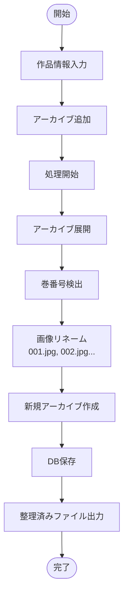

# Manga Organizer

日本語漫画アーカイブを自動整理・再パッケージ化する Windows 向け GUI アプリケーション

[](https://github.com/koupent/manga-organizer/releases)
[](LICENSE)

## 🎯 主な機能

### 📚 アーカイブ管理

- **多形式対応**: ZIP, RAR, 7z, CBZ, CBR, CB7, EPUB
- **ネスト処理**: アーカイブ内のアーカイブも自動展開
- **巻番号自動検出**: 第 X 巻、vol.X、vX など多様なパターンに対応
- **画像リネーム**: 001.jpg, 002.jpg...の連番に自動変換

### 🗂️ データベース機能

- 作品・作者情報の永続管理
- JSON 形式でのエクスポート/インポート
- 重複作品の自動認識

### 🌐 API 連携

- AniList/MyAnimeList 連携で作者名自動取得
- 日本語作者名優先
- API キャッシュによる高速化

### 🖥️ ユーザーインターフェース

- ドラッグ&ドロップ対応
- リアルタイム処理ログ
- 自然順ソート（1→2→10 の正しい順序）
- 完全日本語 UI

## 🔧 前提条件

### RAR 形式のアーカイブを扱う場合

MangaOrganizer で RAR 形式（.rar, .cbr）のファイルを処理するには、7-Zip のインストールが必要です。

#### 7-Zip のインストール方法（推奨）

1. **公式サイトからダウンロード**

   - [7-Zip 公式サイト](https://www.7-zip.org/download.html)にアクセス
   - Windows 64-bit 版（例：7z2408-x64.exe）をダウンロード

2. **インストール**

   - ダウンロードしたインストーラーを実行
   - デフォルト設定（C:\Program Files\7-Zip\）でインストール
   - 管理者権限が必要な場合があります

3. **確認**
   - インストール後、MangaOrganizer が自動的に 7-Zip を検出します
   - RAR 形式のファイルが処理できるようになります

#### 注意事項

- **ZIP, 7z, CBZ 形式**: これらの形式は 7-Zip なしで処理可能です
- **WinRAR**: 代替として[WinRAR](https://www.win-rar.com/)も使用可能ですが、有料ソフトです
- **v3.8.0 以降の変更**: セキュリティ向上のため、7za.exe のバンドルを廃止しました（Breaking Change）

## 📥 ダウンロード

### Windows 実行ファイル（推奨）

[最新リリース](https://github.com/koupent/manga-organizer/releases/latest)から`MangaOrganizer-vX.X.X.exe`をダウンロード

**特徴:**

- インストール不要
- Python 環境不要
- ダブルクリックで起動

### インストール手順

1. **専用フォルダを作成**

   ```
   C:\Users\[ユーザー名]\Documents\MangaOrganizer\
   ```

   または任意の場所に `MangaOrganizer` フォルダを作成

2. **実行ファイルを配置**

   - ダウンロードした `MangaOrganizer-vX.X.X.exe` をフォルダに移動
   - ファイル名を `MangaOrganizer.exe` に変更しても OK

3. **初回起動**
   - `MangaOrganizer.exe` をダブルクリック
   - 必要なフォルダが自動作成されます

### 使用後のフォルダ構成

```
MangaOrganizer/
├── MangaOrganizer.exe          # 実行ファイル
├── data/                        # データ保存用（自動作成）
│   ├── manga_info.db           # 作品データベース
│   └── manga_info_backup.json  # データベースバックアップ
├── logs/                        # ログファイル（自動作成）
│   └── manga_organizer_YYYYMMDD.log
└── _internal/                   # 一時ファイル（自動作成・削除）
```

**注意事項:**

- `data/` フォルダには作品情報が保存されるため、削除しないでください
- `logs/` フォルダは問題解決時に必要になる場合があります
- `_internal/` は実行時の一時フォルダで、終了時に自動削除されます

## 🚀 使い方

### 基本的な使用手順

1. **MangaOrganizer.exe を起動**

   - ダウンロードした実行ファイルをダブルクリック

2. **作品情報を入力**

   - 作者名: 手動入力または API 自動取得
   - 作品名: 入力すると作者名候補が表示

3. **アーカイブファイルを追加**

   - ドラッグ&ドロップ
   - または「ファイル追加」ボタンから選択
   - 複数ファイル一括処理対応

4. **出力先を選択**

   - 「出力先選択」ボタンで保存先を指定

5. **処理を開始**
   - 「処理開始」ボタンをクリック
   - 進捗はログウィンドウに表示

### 出力形式

```
[作者名] 作品名/
├── [作者名] 作品名 第001巻.zip
├── [作者名] 作品名 第002巻.zip
└── [作者名] 作品名 第003巻.zip
```

各 ZIP ファイル内:

```
001.jpg  # ページ順に連番
002.jpg
003.jpg
...
```

## 🔧 高度な機能

### データベース管理

「DB 編集」ボタンから:

- 登録済み作品の編集・削除
- 新規作品の手動追加
- JSON エクスポート/インポート

### 巻番号検出ロジック

優先順位:

1. **画像ディレクトリ名**: `001/`、`chapter_05/`など
2. **アーカイブ名**: 単一ボリュームの場合のみ
3. **フォールバック**: 処理順序のインデックス

特殊判定:

- 番外編、外伝、短編などの認識
- 一時ディレクトリ名は無視

## 💻 開発者向け

開発環境のセットアップ、ビルド方法、バージョンアップ手順などの詳細は [DEVELOPMENT.md](DEVELOPMENT.md) を参照してください。

## 📊 処理フロー



## ❓ トラブルシューティング

### よくある質問

**Q: RAR ファイルが開けない**

- A: v3.8.0 以降は 7-Zip のシステムインストールが必要です。上記の[前提条件](#前提条件)セクションを参照してください

**Q: 巻番号が正しく検出されない**

- A: ファイル名に「第 X 巻」「vol.X」などを含めてください

**Q: ウイルス対策ソフトが警告を出す**

- A: PyInstaller でビルドした exe は誤検知されることがあります。v3.8.0 以降では誤検知対策を実施済みです。
  - Windows Defender の除外設定に追加することで回避できます
  - 詳細は[リリースノート](https://github.com/koupent/manga-organizer/releases/tag/v3.8.0)を参照

**Q: API 連携が動作しない**

- A: インターネット接続を確認してください

### エラーが発生した場合

1. ログウィンドウのエラーメッセージを確認
2. [Issues](https://github.com/koupent/manga-organizer/issues)で既知の問題を検索
3. 新しい Issue を作成して報告

[全ての更新履歴](manga-organizer/CHANGELOG.md)

## 📄 ライセンス

MIT License - 詳細は[LICENSE](LICENSE)を参照

## 📧 サポート

- [Issues](https://github.com/koupent/manga-organizer/issues) - バグ報告・機能要望
- [Discussions](https://github.com/koupent/manga-organizer/discussions) - 質問・議論

## 🙏 謝辞

このプロジェクトは以下のライブラリを使用しています:

- [Pillow](https://python-pillow.org/) - 画像処理
- [py7zr](https://github.com/miurahr/py7zr) - 7z 形式対応
- [tkinterdnd2](https://github.com/pmgagne/tkinterdnd2) - ドラッグ&ドロップ
- [7-Zip](https://www.7-zip.org/) - アーカイブ処理
