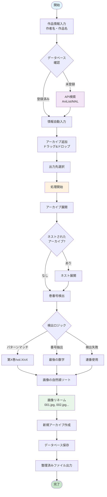
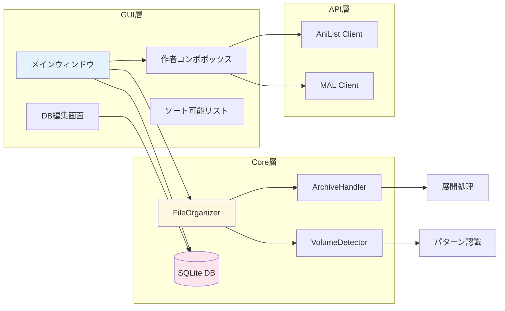

# Manga Organizer

日本語漫画のアーカイブファイルを整理・再パッケージ化する GUI アプリケーション

## 処理フロー



## アーキテクチャ



## 主な機能

### アーカイブ管理

- ZIP, RAR, 7z, CBZ, CBR, CB7, EPUB 形式に対応
- ネストされたアーカイブの自動展開と処理
- 巻番号の自動検出（第 X 巻、vol.X、vX 等のパターン対応）
- 特別版（番外編、外伝、短編等）の認識

#### 巻番号推定ロジック

巻番号は以下の優先順位で推定されます：

1. **画像ディレクトリ名からの推定**（最優先）
   - 画像を直接含むディレクトリの名前から数字を抽出
   - 複数の数字が含まれる場合は最後の数字を巻番号として採用
   - 例：`001/` → 1巻、`chapter_05/` → 5巻、`vol_03_page_100/` → 100巻

2. **単一ボリュームアーカイブのみアーカイブ名から推定**
   - 画像ディレクトリが1つだけの場合、アーカイブ名も参考にする
   - 例：`manga_vol_03.zip`（単一ディレクトリ）→ 3巻

3. **フォールバック**
   - 巻番号が推定できない場合は、処理順序のインデックスを使用

詳細な仕様は[巻番号推定ロジック仕様書](docs/volume-detection-spec.md)を参照してください。

### 画像リネーム機能（v3.6.0 新機能）

- アーカイブ内の画像を連番（001.jpg, 002.jpg...）に自動リネーム
- 自然順ソートアルゴリズムで正しいページ順を維持
- 元の拡張子（.jpg, .png, .webp 等）を保持
- 漫画リーダーとの互換性向上

### データベース機能

- 作品名と作者名の永続的な管理
- 手動での情報編集機能
- JSON 形式でのエクスポート/インポート
- 重複作品の自動認識

### API 連携

- AniList API との連携による作者名自動取得
- MyAnimeList (Jikan API)との連携
- 日本語作者名の優先取得
- キャッシュによる API 呼び出しの最適化

### ユーザーインターフェース

- ドラッグ&ドロップによるファイル追加
- 自然順ソート（1, 2, 10 の正しい順序）
- リアルタイム処理ログ表示
- モーダルデータベース編集ウィンドウ
- 日本語 UI

## 必要環境

- Python 3.8 以上
- Windows/macOS/Linux 対応

## インストール

### uv を使用（推奨）

```bash
# uvのインストール
pip install uv

# 依存関係のインストール
uv sync
```

### pip を使用

```bash
# 依存関係のインストール
pip install pillow>=10.0.0 py7zr>=0.20.0 tkinterdnd2>=0.3.0 requests>=2.31.0
```

### 7-Zip（RAR 対応用、オプション）

RAR ファイルを処理する場合、7-Zip のインストールを推奨：

- Windows: [7-Zip 公式サイト](https://www.7-zip.org/)からダウンロード
- macOS: `brew install p7zip`
- Linux: `sudo apt-get install p7zip-full`

## 使用方法

### アプリケーションの起動

```bash
python main.py
```

### 基本的な使い方

1. **作者名と作品名を入力**

   - 作品名を入力すると、API から作者名候補が自動表示
   - データベースに登録済みの情報も表示

2. **アーカイブファイルを追加**

   - ドラッグ&ドロップまたは「ファイル追加」ボタンで選択
   - 複数ファイルの一括処理に対応

3. **出力先を選択**

   - 「出力先選択」ボタンで保存先ディレクトリを指定

4. **処理を実行**
   - 「処理開始」ボタンで再パッケージ化を開始
   - 進捗はログウィンドウでリアルタイム表示

### データベース管理

「DB 編集」ボタンから：

- 登録済み作品の編集・削除
- 新規作品の手動追加
- JSON 形式でのエクスポート/インポート

## 出力形式

### ディレクトリ構造

```
[作者名] 作品名/
├── [作者名] 作品名 第001巻.zip
├── [作者名] 作品名 第002巻.zip
└── [作者名] 作品名 第003巻.zip
```

### アーカイブ内の画像（v3.6.0 以降）

```
第001巻.zip の中身:
├── 001.jpg  # 元: page1.jpg
├── 002.jpg  # 元: page2.jpg
├── 003.jpg  # 元: page10.jpg（自然順ソート済み）
└── ...
```

## 設定ファイル

アプリケーションの設定は以下に保存されます：

- データベース: `data/manga_info.db`
- 設定: アプリケーションフォルダ内

## デスクトップアプリ（EXE）のビルド

### PyInstaller を使用したビルド

#### 1. PyInstaller のインストール

```bash
pip install pyinstaller
```

#### 2. spec ファイルの作成

`manga_organizer.spec`ファイルを作成：

```python
# manga_organizer.spec
import sys
from pathlib import Path

block_cipher = None

a = Analysis(
    ['main.py'],
    pathex=[],
    binaries=[],
    datas=[
        ('src', 'src'),
        ('data', 'data'),
    ],
    hiddenimports=[
        'tkinterdnd2',
        'PIL',
        'py7zr',
        'requests',
    ],
    hookspath=[],
    hooksconfig={},
    runtime_hooks=[],
    excludes=[],
    win_no_prefer_redirects=False,
    win_private_assemblies=False,
    cipher=block_cipher,
    noarchive=False,
)

pyz = PYZ(a.pure, a.zipped_data, cipher=block_cipher)

exe = EXE(
    pyz,
    a.scripts,
    a.binaries,
    a.zipfiles,
    a.datas,
    [],
    name='MangaOrganizer',
    debug=False,
    bootloader_ignore_signals=False,
    strip=False,
    upx=True,
    upx_exclude=[],
    runtime_tmpdir=None,
    console=False,  # Falseでコンソールウィンドウを非表示
    disable_windowed_traceback=False,
    argv_emulation=False,
    target_arch=None,
    codesign_identity=None,
    entitlements_file=None,
    icon='icon.ico'  # アイコンファイルがある場合
)
```

#### 3. ビルド実行

```bash
# specファイルを使用してビルド
pyinstaller manga_organizer.spec

# または、ワンライナーでビルド（簡易版）
pyinstaller --onefile --noconsole --name MangaOrganizer main.py
```

#### 4. 追加ファイルの配置

ビルド後、`dist/MangaOrganizer/`に以下を配置：

- 7-Zip のインストーラー（RAR 対応用）
- README.md

### PyInstaller を使用したビルド（推奨）

#### 1. PyInstaller のインストール

```bash
uv add pyinstaller
# または
pip install pyinstaller
```

#### 2. ビルド実行

```bash
# 推奨コマンド（srcディレクトリを明示的にパスに追加）
# 注: PyInstaller v6.0以降では一部のWindowsオプションが削除されました
uv run pyinstaller --onefile --noconsole --windowed --name MangaOrganizer --paths src --add-data "data;data" src/main.py

# または、ビルドスクリプトを使用（推奨）
./build.sh  # Linux/Mac/Git Bash
# または
powershell -ExecutionPolicy Bypass -File build-windows.ps1  # Windows PowerShell
```

#### 3. ビルド後の確認

- `dist/MangaOrganizer-v{バージョン}.exe`が生成されます（例：`MangaOrganizer-v3.5.0.exe`）
- ファイルサイズは約 24MB 程度です
- 起動テストを必ず行ってください

### ビルド後の配布

```
MangaOrganizer/
├── MangaOrganizer.exe    # 実行ファイル
├── data/                  # データベース用フォルダ
├── README.md             # 使用説明書
└── 7z2401-x64.exe       # 7-Zipインストーラー（オプション）
```

### 注意事項

1. **tkinterdnd2 の対応**

   - ドラッグ&ドロップ機能のため、tkinterdnd2 の DLL が必要
   - ビルド環境に tkinterdnd2 が正しくインストールされている必要あり

2. **アンチウイルスの誤検知**

   - PyInstaller でビルドした EXE は誤検知されることがある
   - コード署名証明書の取得を推奨

3. **ファイルサイズ**
   - --onefile オプション使用時は 50-100MB 程度
   - --onefolder オプションの方が起動が速い

## トラブルシューティング

### RAR ファイルが開けない

- 7-Zip がインストールされているか確認
- Windows の場合、Program Files に 7z.exe が存在するか確認

### 巻番号が正しく検出されない

- ファイル名に巻番号を示すキーワード（巻、vol 等）を含めてください
- 一時ディレクトリ名（\_extracted*、temp 等）からは番号を抽出しません
- v3.6.2 以降：複数巻を含むアーカイブでは各画像ディレクトリから個別に巻番号を推定

### API から作者名が取得できない

- インターネット接続を確認
- 作品名の表記を確認（英語/日本語）

### EXE が起動しない

- Windows Defender やアンチウイルスソフトの設定を確認
- Visual C++ 再頒布可能パッケージがインストールされているか確認

## ライセンス

MIT License

## 更新履歴

詳細は[CHANGELOG.md](CHANGELOG.md)を参照してください。

## バージョン

現在のバージョン: 3.6.2
