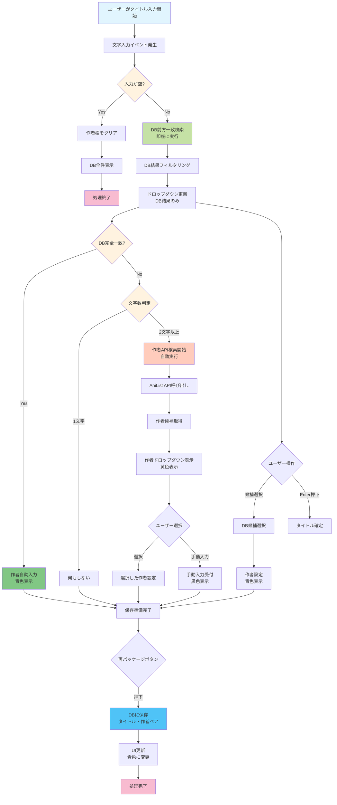

# タイトル・作者入力機能

## 概要

タイトルと作者名を効率的に入力するための機能です。
データベース検索により、登録済みの作品については自動的に作者名を補完します。

## 基本的な使い方

### タイトル入力

1. タイトル欄に作品名を入力開始
2. データベースに登録済みの作品なら候補が表示される
3. 候補から選択、または続けて入力
4. Enter/Tab キーで確定

### 作者名の自動入力

- **タイトル変更時**: まず作者欄をクリア（前の作者が残らない）
- **DB に登録済みの場合**: 即座に自動入力（青色表示）
- **新規作品の場合（2文字以上）**: 自動的に API 検索を開始して作者候補を表示
- **手動入力**: いつでも上書き可能

## 詳細な動作仕様

### サジェスチョン表示

| 入力文字数 | 動作                | 検索対象    |
| ---------- | ------------------- | ----------- |
| 0 文字     | 表示なし            | -           |
| 1 文字以上 | DB 検索のみ（即座） | ローカル DB |

### 入力方法の対応

| 入力方法           | 検出方法                | 作者欄更新 | 動作             |
| ------------------ | ----------------------- | ---------- | ---------------- |
| キーボード入力     | KeyRelease イベント     | ✅ 自動    | クリア → DB 検索 |
| ペースト (Ctrl+V)  | StringVar trace + Paste | ✅ 自動    | クリア → DB 検索 |
| カット (Ctrl+X)    | StringVar trace + Cut   | ✅ 自動    | クリア → DB 検索 |
| プログラム変更     | StringVar trace         | ✅ 自動    | クリア → DB 検索 |
| ドロップダウン選択 | ComboboxSelected        | ✅ 自動    | クリア → DB 検索 |

**重要**: タイトルが変更されるたびに、まず作者欄をクリアしてから新しい検索を実行

### 表示形式

```
[DB] 進撃の巨人              // データベースから
```

### キーボード操作

| キー   | 動作                 |
| ------ | -------------------- |
| ↑↓     | 候補選択             |
| Enter  | 選択確定             |
| Tab    | 次フィールドへ       |
| ESC    | クリア/キャンセル    |
| Ctrl+V | ペースト（自動更新） |
| Ctrl+X | カット（自動更新）   |
| Ctrl+A | 全選択               |

### 色分け表示

| 色    | 意味        | 状態                         |
| ----- | ----------- | ---------------------------- |
| 🔵 青 | DB 登録済み | 保存済みデータ               |
| 🟡 黄 | API 取得    | 未保存（再パッケージで保存） |
| ⚫ 黒 | 手動入力    | ユーザー入力                 |

## 技術仕様

### コンポーネント構成

```
TitleAuthorCombo
├── SimpleTitleCombobox       # シンプル版（DB専用）
├── EnhancedTitleCombobox     # 拡張版（DB+API）
└── EnhancedAuthorCombobox    # 作者入力（遅延検索）
```

### データフロー



### API 仕様（作者検索のみ）

#### 使用 API

- **AniList GraphQL API**（作者名検索専用）
- エンドポイント: `https://graphql.anilist.co`
- レート制限: 2 リクエスト/秒

#### 取得データ

- 作者名（native フィールド = 日本語名）

### パフォーマンス

| 項目                           | 目標値 | 実測値 |
| ------------------------------ | ------ | ------ |
| DB 検索レスポンス              | <50ms  | ~30ms  |
| キー入力反映                   | 即座   | <16ms  |
| 作者 API 検索（2文字以上入力時） | <1 秒  | ~800ms |

### トリガー設定

- **DB 検索**: タイトル1文字以上で即座実行
- **作者 API 検索**: タイトル2文字以上で自動実行

### キャッシュ

- **作者 API 結果**: 30 秒間メモリキャッシュ
- **DB 結果**: セッション中永続

## トラブルシューティング

### よくある質問

**Q: 作者名が表示されない**
A: タイトルを2文字以上入力すると自動的にAPI検索が開始されます。検索結果が表示されるまで少しお待ちください。

**Q: 候補が多すぎる**
A: より具体的なタイトルを入力してください。3 文字以上でより正確な結果が得られます。

**Q: 日本語の作者名が出ない**
A: AniList のデータに日本語名がない場合があります。その場合は手動で入力してください。

**Q: 入力が遅い**
A: ネットワーク接続を確認してください。オフライン時は DB 検索のみ動作します。

### エラー対処

| エラー         | 原因             | 対処法                       |
| -------------- | ---------------- | ---------------------------- |
| API 接続エラー | ネットワーク問題 | オフラインで DB 検索のみ使用 |
| 文字化け       | エンコーディング | UTF-8 設定を確認             |
| 候補が出ない   | キャッシュ問題   | アプリケーション再起動       |

## 設定とカスタマイズ

### 設定可能な項目

- デバウンス時間（デフォルト: 300ms）
- 最大表示候補数（デフォルト: 20 件）
- キャッシュ有効時間（デフォルト: 30 秒）

### カスタマイズ例

```python
# デバウンス時間の変更
self.debounce_delay = 500  # 500msに変更

# 表示候補数の変更
MAX_SUGGESTIONS = 30  # 30件まで表示
```

## 今後の改善予定

- [ ] オフライン時の動作改善
- [ ] 複数作者の対応
- [ ] 別名・異表記の統合
- [ ] 入力履歴の活用
- [ ] より高度な検索アルゴリズム
